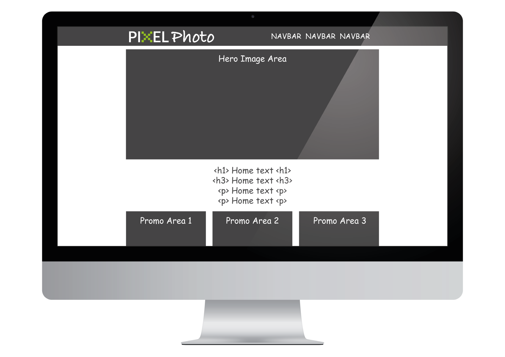
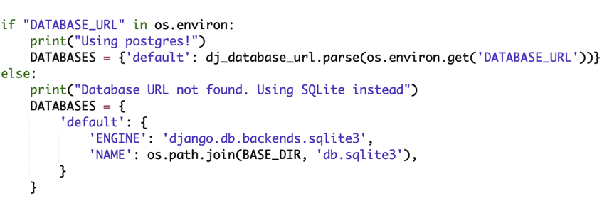

# Pixel Photo

Pixel Photo is a stock photography website for all user disciplines. Whether you are a design agency, a marketing agency, a local print works or a student, all users can get access to premium stock photography at a fraction of the expected price.

Many marketing agencies and designers need access to quality stock photography to speed up proofing process (while not compromising on the look). And to complete final projects with high resolution files for print. Currently websites like iStock, Shutterstock and DepositPhotos cater for this need but at high prices.

Pixel Photo sells premium quality, high resolution photography without any licensing restrictions for €1 per image.

Unregistered users can browse all images on the site manually and by category. Users can also search for images. Unregistered users can submit a contact form to the site owner to submit queries prior to registration/purchase.

Registered users can perform all the same tasks as unregistered users, but they can also upvote/downvote products, thus (overtime) identifying to other registered users the more popular images within a category. Registered users can also purchase images via Stripe and have a high resolution file sent direct to their registered email address.

The deployed Pixel Photo website is here - [pixel-photo-app.herokuapp.com](https://pixel-photo-app.herokuapp.com/)

## UX

#### User Stories
 
- DD Design agency is a company with many demanding clients. The business is growing and inhouse designers are pushing out proofs and a mockups at a fast pace. Image selection can be frustrating when marketers, administrators and designers need to acquire suitable project images, ensure they will be free to use across all areas of the project, and not go over budget. With images for €1, AceWeb will be using Pixel Photo.

- Cork Institute of Technology have their own inhouse design department to cater for the admin needs of the college, and also the design needs specific to each department, students union, etc. The amount of promotional (print and online) materials required at varying points of the year can be staggering. In order for these materials to be current, relevant and engaging, suitable stock elements (photos, vectors, etc) need to be sourced within department budget. With images for €1, AceWeb will be using Pixel Photo.

- AceWeb is a design agency that builds templates for popular open source Content Management Systems. These can be hit and miss and highly subjective as to whether they sell or not. So it is essential that minimal cost goes into each one, while also making them as visually appealing as possible. With images for €1, AceWeb will be using Pixel Photo.

#### Design Considerations

The design is modern and minimalist ensuring a great UX for creative types as well as the general public. Minimal use of secondary colour helps it stand out more. Site is mainly designed in monotone.

#### Wireframing
 
I used Adobe Photoshop and Illustrator to envision my website and create mockups, logo and brand identity.

#### Responsive Design

The App is designed to work on all devices.

Proposed layout -

## Features

#### Responsive Design
- Responsive design across all browsers for best possible UX.

#### Contact Form
- A contact form can be used by any user to submit an enquiry to the site owner. Users do not need to be signed in to use this form.

#### Products database
- Products and categories are stored in a MySQL relational database. SQLite3 was used locally in production, before migrating to cloud based PostgreSQL in live environment on Heroku. Users do not need to be signed in to browse images/products.

#### User Authentication
- In order to purchase images, and/or upvote/downvote images, users need to be logged in to the website. If a user is not logged in, then Register and Log In are displayed, and upvote/downvote buttons and scores are not visible to them. If a user is logged in, then Profile and Log Out are displayed, and they can upvote/downvote images and see image scores.

#### eCommerce
- Stripe payment plugin is installed to handle all transactions.

#### Cart & Checkout
- The Cart App stores any selected images in session and adds them to the cart. It is clear to the user when an image is in their cart because it will appear in the Navbar. When the cart is empty, it does not appear in the Navbar.
- The Checkout function requires a user to be signed in using the `@login_required` decorator. If a user tries to transact, they will need to register or sign in.
- On successful transaction, the checkout function retrieves the corresponding high resolution image `media/originalimages/image.jpg` of the watermarked image they have chosen, and emails the file directly to them.

#### Possible features to implement
- With further learning I would extend Django the user model, allowing some users to purchase only and others to upload and sell their own images.

## Technologies Used

- [HTML5](https://en.wikipedia.org/wiki/HTML5)

- [CSS3](http://www.css3.info/)

- [Javascript](https://www.javascript.com/)

- [JQuery](https://jquery.com)

- [Python](https://www.python.org/)

- [Django](https://www.djangoproject.com/)

- [Stripe](https://stripe.com/ie)

- [Bootstrap CSS](https://bootswatch.com/3/flatly/)

## Manual Testing

#### User Stories addressed

- The App addresses the needs/wants of submitted user stories admirably.
- The App is easy to use and images can be searched/found with ease.
- The App is child friendly and easy to use for all ages.

#### Design

- The responsiveness of the App was tested in MAC OSX Safari, Firefox and Chrome browser windows at varying sizes and displays as intended/desired.

- The responsiveness of the App was tested in iPhone6 Chrome and Safari Apps and displays as intended/desired.

- Also tested on a random selection of phones, tablets and desktop browsers using https://www.browserstack.com/ extension in Firefox.

#### Code

W3 best practice guidelines are used throughout to ensure my code as clean and error free as possible.

- HTML code checked with validator.W3.org returns -
    - Document checking completed. No errors or warnings to show.

- CSS code checked with jigsaw.w3.org/css-validator returns -
    - Minor errors found in Bootstrap file.

#### Forms

- CONTACT FORM -
    - The form will not submit without data in all fields. Furthermore, the Email field must include an @ symbol thus coaxing the user in to input a genuine email address.

- REGISTRATION FORM -
    - The form will not submit without data in all fields. Furthermore, the Email field must include an @ symbol thus coaxing the user in to input a genuine email address and both password fields need to match.

#### AWS issue, specific to my App

I have used an AWS S3 bucket to store my products/images and also my static files. The live roots of these files can be revealed by using Developer Tools in a browser.

However I was unable to make my checkout/email function work as desired when using AWS.
I was unable to attach a high resolution image stored on AWS to an email to my customer.

`email.attach_file(product.originalimage.url)`

This code caused an error and the transaction failed, but with `DEBUG = True` not before it revealed the exact path to the high resolution file and could easily be used to get the exact path to all high resolution files.

`email.attach_file(“media/” + str(product.originalimage))`

So my images (watermarked and high resolution) remain as they were in production in a top level media folder On successful transaction the high resolution image is sent as an attachment in individual emails to each customer.

This is something I must research and keep an eye on to see if there’s a solution to use files saves on AWS as attachments in an application email.

## Deployment

Pixel Photo App is a Python application built in Cloud9 and periodically committed to a Github Repository which in the latter stages of development auto deployed to Heroku.

Check out version control for commit steps during development.

Before pushing to Heroku, Travis Continuous Integration was connected to the Github Repository. This is very useful in highlighting flaws in your construction or potential errors before deployment. e.g. some dependencies auto added to your requirements.txt file in the Cloud9 environment may not be required (or not work) in a live environment like Heroku and Travis will spot these for you. You can upgrade or delete as necessary.

A Github Respository was initialized `git init` very early in production so all sensitive environment variables were saved in and retrieved from my env.py file at the top level of the project. This file was listed in a `.gitignore` file thus ensuring that the sensitive credentials remain private and never pushed to the public repository.
- Django SECRET_KEY
- Stripe KEYS
- Gmail CREDENTIALS
- PostgreSQL live DB URL
- Amazon AWS KEYS

During production on Cloud9 a local SQLite3 database was used and media images and static files were stored locally.

The live site on Heroku uses a cloud based PostgreSQL database and media images and static files are stored on Amazon Simple Storage Service (Amazon S3), an object storage service that offers industry-leading scalability, data availability, security, and performance. 

A number of key steps are required in this deployment.

While working in Cloud9, all environment variables are accessed through settings.py
`if os.path.exists(‘env.py’):`
`    import env`
All these environment variables to be added as Config Vars to Heroku App before deployment.
This code is #commented out# of deployed settings.py file.

A new database, local and live configuration was added to settings.py file, so that if the DB is presented in environment (i.e. PostgreSQL on Heroku) it is used, and if not, then the App reverts to use the local SQLite3 Cloud9 settings.

It is essential to `python3 manage.py createsuperuser` and `python3 manage.py makemigrations` and `python3 manage.py migrate` on first use of this new live database.

IMPORTANT

Heroku web applications require a `Procfile`

And a Procfile requires `gunicorn`

`pip install gunicorn` and list it in your requirements.txt as well.

Create a new top level file called `Procfile` with a capital “P” and paste `web: gunicorn myproject.wsgi` into it and save.

This file is used to explicitly declare your application’s process types and entry points which are retrieved from your wsgi.py file.

You can view the deployed App here - [Pixel Photo](https://pixel-photo-app.herokuapp.com/)

## Credits

#### Content
- All photos are sourced from a license-free, free of charge stock photography website - [Free stock photos · Pexels](https://www.pexels.com/)

- All other information is fictional

#### Media
- The Pixel Photo logo is designed by the developer Barry Cunningham

#### Acknowledgements

- The idea for Pixel Photo is my own.

- I received support from Code Institute Tutors and from the Code Institute Slack community and am very grateful for same.

- Specifically I received support from Joke Heyndels Code Institute to write a user’s purchases in their checkout cart into a new dictionary `id_dict`. This enabled the function to iterate through the cart and send an individual email for each high resolution image purchased to the user. Thanks @jowings